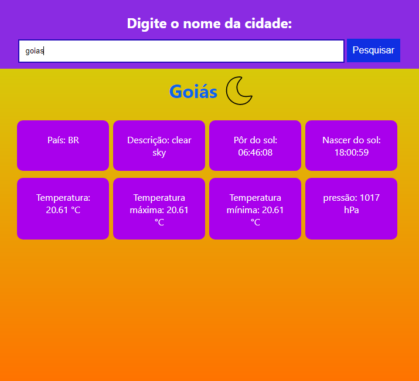

# Wheater project




## Introdução

Esse é um site simples que usa a api do OpenWheaterMap para pesquisar por uma cidade e ver informações sobre o seu clima. O projeto foi feito com React.js

## 💻 Pré-requisito

Antes de começar, verifique se você atendeu ao seguinte requisito:
* Você instalou a versão mais recente do Node.js

## ☕ Usando o Projeto

Para usar o projeto de clima, siga estas etapas:

utilize o comando:

```
git clone https://github.com/EnzoSylvestrin/Wheater.git
```

e abra o projeto pelo visual studio code

então abra o terminal no diretório em que está o projeto e utilize 

```
npm start
```
